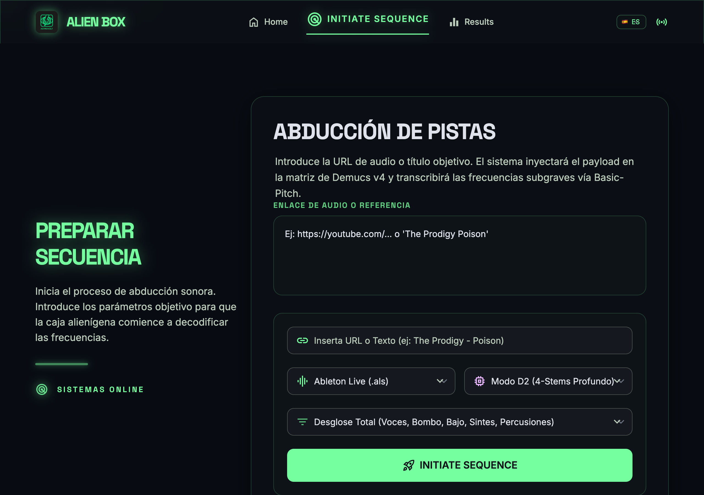
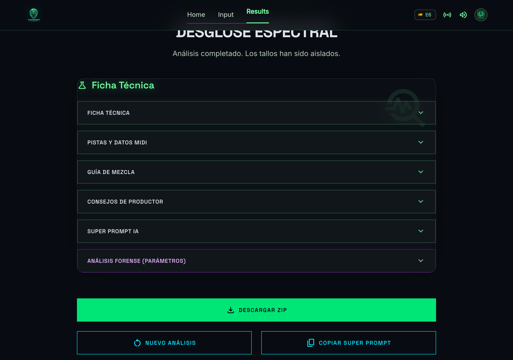

# Alien Box: The Universal Musical Bible 👽




## 📥 Download

[](https://github.com/produktes-code/alien-box-music-interface/releases/latest)
[](https://github.com/produktes-code/alien-box-music-interface/releases/latest)
[](https://github.com/produktes-code/alien-box-music-interface/releases/latest)
🌐 **Read this in:** **🇬🇧 English** | [🇪🇸 Español](README_es.md) | [🇩🇪 Deutsch](README_de.md) | [🇷🇺 Русский](README_ru.md) | [🇯🇵 日本語](README_ja.md) | [🇺🇦 Українська](README_uk.md) | [🇨🇳 中文](README_zh.md)

---


**Alien Box** is a state-of-the-art multimodal forensic audio analysis engine and DAW template generator. It connects directly to global music networks to extract real metadata from any text input, dissects the frequency and dynamic parameters of commercial tracks, and generates customized starter templates for major DAWs (Ableton, Logic Pro, Cubase, FL Studio, Pro Tools).

Built with precision engineering by **CHUS BZN** at **produktes-code**.

## 🚀 Features
- **Universal Search:** Input any YouTube link, Spotify link, or free text (e.g., "The Prodigy Poison").
- **Brutal Forensic Analysis:** Calculates Target LUFS, specific EQ curves (Kick/Bass crossover), and VCA compression attack/release times.
- **Multimodal Export:** Generates a real ZIP file containing a pre-routed DAW template.
- **Organic UI:** Fluid, breathing graphic interface with dynamic particle backgrounds.
- **Native Universal PDF Manual (V14):** High-resolution generated PDF manual translated symmetrically into 7 languages, meticulously formatted and perfectly scaled for DIN A5 printing.

## 🛠 Installation

1. Download the installer for your OS from the [Releases](https://github.com/produktes-code/alien-box-music-interface/releases) page.
2. If using Windows: run the `.exe`. Windows SmartScreen might appear, click "More info" -> "Run anyway".
3. If using macOS: open the `.dmg` and drag the app to Applications. Gatekeeper might block it; right-click the app and select "Open".
4. If using Linux: make the `.AppImage` executable and run it, or install the `.deb`.

### Development Setup
Copy `.env.example` to `.env` if you plan to add custom API keys for extensions.

```bash
npm install
npm run pack:mac # or pack:win, pack:linux
```

---
*Part of the `produktes-code` ecosystem. CC BY-NC-SA 4.0. CORPORATE STANDARD - RETAIL READY.*
