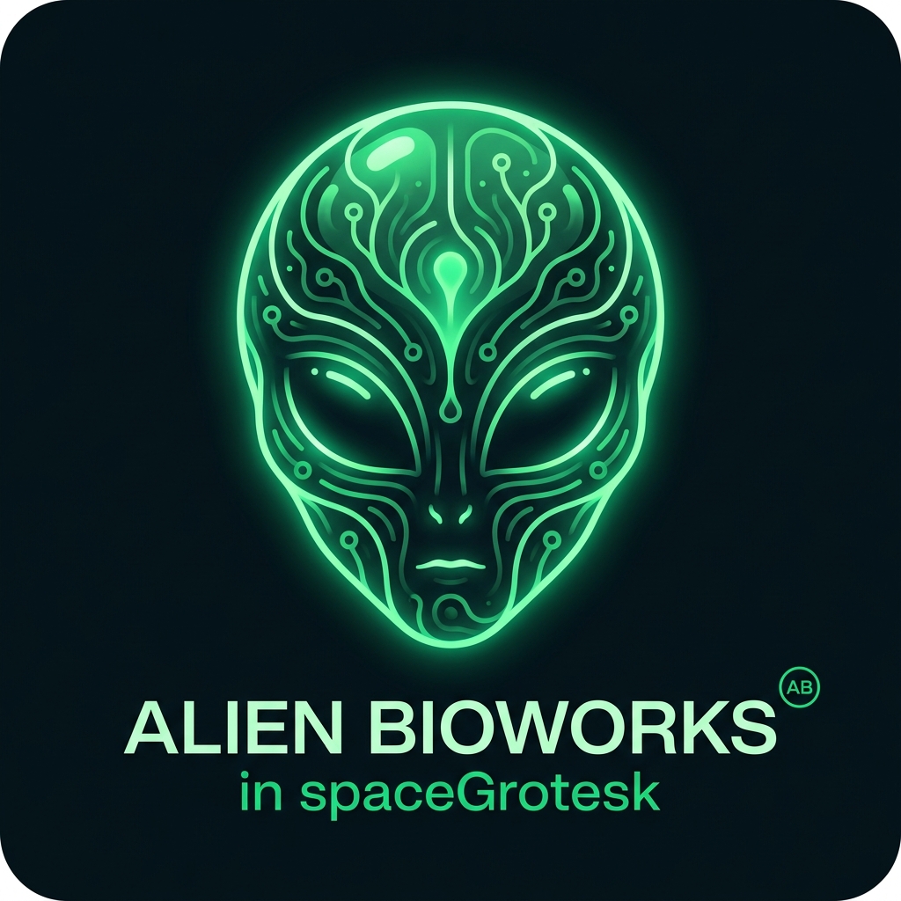

# Alien Box: універсальна музична Біблія 👽



🌐 **Читати на:** [🇬🇧 English](README.md) | [🇪🇸 Español](README_es.md) | [🇩🇪 Deutsch](README_de.md) | [🇷🇺 Русский](README_ru.md) | [🇯🇵 日本語](README_ja.md) | **🇺🇦 Українська** | [🇨🇳 中文](README_zh.md)

---

---

**Alien Box** — це сучасний мультимодальний механізм аналізу аудіокриміналістичної експертизи та генератор шаблонів DAW. Він підключається безпосередньо до глобальних музичних мереж, щоб витягувати реальні метадані з будь-якого текстового введення, аналізує частоту та динамічні параметри комерційних треків і генерує налаштовані стартові шаблони для основних DAW (Ableton, Logic Pro, Cubase, FL Studio, Pro Tools).

Створено за допомогою точної інженерії **CHUS BZN** за **produktes-code**.

## 🚀 Особливості
- **Універсальний пошук:** введіть будь-яке посилання на YouTube, Spotify або довільний текст (наприклад, "The Prodigy Poison").
- **Брутальний криміналістичний аналіз:** розраховує цільову LUFS, специфічні криві еквалайзера (кросовер Kick/Bass) і час атаки/вивільнення компресії VCA.
- **Мультимодальний експорт:** генерує справжній ZIP-файл, що містить попередньо направлений шаблон DAW.
- **Organic UI:** Гнучкий, динамічний графічний інтерфейс із динамічним фоном частинок.
- **Нативний універсальний PDF-посібник (V14):** PDF-посібник із високою роздільною здатністю, симетрично перекладений на 7 мов, ретельно відформатований і ідеально масштабований для друку DIN A5.

## 🛠 Встановлення

### 1. Налаштування серверної частини
Сервер працює на легкому сервері Python.
```баш
# 1. Запустіть сервер аналізу
python3 alienbox_server.py
```

### 2. Інтерфейс
Просто відкрийте `splash_screen_organic_v3_final/code.html` у будь-якому сучасному веб-переглядачі.

### 3. Створення посібника (V14)
Щоб скласти абсолютний симетричний універсальний посібник V14 у форматі DIN A5:
```баш
python3 build_universal_manual_v14.py
вузол print_multilingual_v14_pdf.js
```

## 📦 Інсталятори будівель (macOS і Windows)
Щоб запакувати Alien Box у нативну настільну програму, ми надаємо сценарії збірки для Electron/PyInstaller. Це готує випуск для нашого репозиторію GitHub.

* **Mac OS (.dmg):** Запустіть `./build_mac.sh`
* **Windows (.exe):** Запустіть `build_win.bat`

---
*Частина екосистеми «produktes-code». CC BY-NC-SA 4.0. КОРПОРАТИВНИЙ СТАНДАРТ - ГОТОВИЙ ДЛЯ РОЗДРІБНОГО ПРОДАЖУ.*